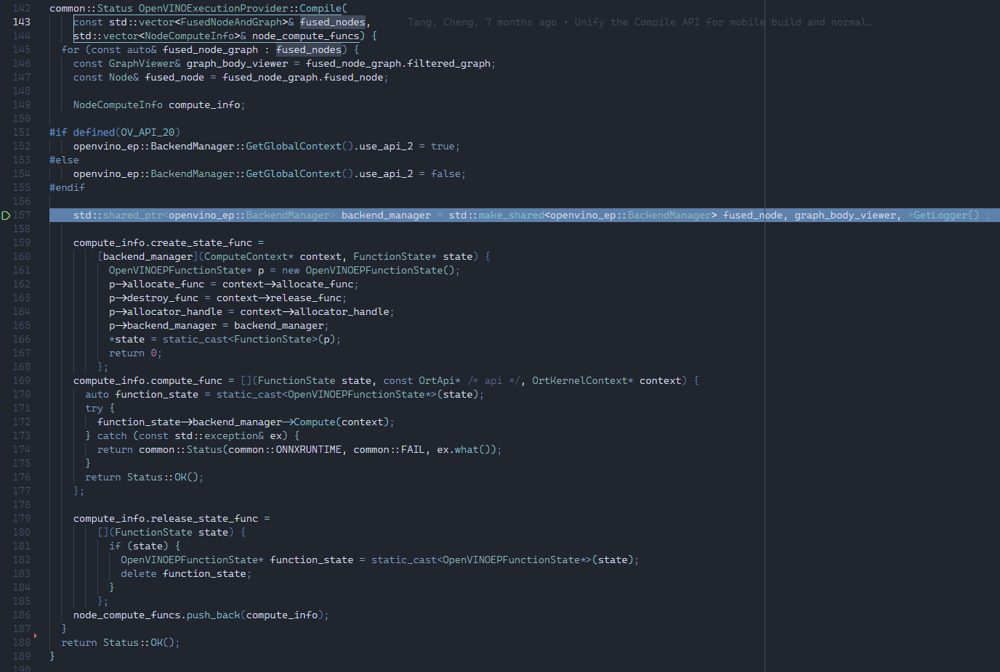

## 1. Valgrind Command

```
valgrind --tool=massif --detailed-freq=100 --max-snapshots=500 --max-threads=100 ./onnxruntime_perf_test -r 10 -I -e openvino -m times /home/xeon/mem_consumption/ResNet.onnx

# --> output file: massif.out.166245
```
```
valgrind --max-threads=100 -v ./onnxruntime_perf_test -r 10 -I -e cpu -m times /home/xeon/mem_consumption/ResNet.onnx
```

### *TODOs
- Bert & ResNet50
	- Bert Model convert to onnx format (https://github.com/pytorch/ort/blob/68b3df7c1c700d49b543e4a0277273b075c91446/torch_ort_inference/demos/bert_for_sequence_classification.py#L208)

- Valgrind
	- Benchmark App --> OV Version? --> 2022.2.0.7713 (latest version)
	- perf-test
		- With Dynamic
			- -i enable_dynamic_shapes --> onnx_perf_test
			- 10, 20, 30 , 50 , ... 100 (mention in the report) --> benchmark_app
		- W/O dynamic shapes

	- For both MLAS & OVEP

## 2. Brute Force (htop observation)

Based on htop observation while debugging

```cpp
PerformanceRunner::PerformanceRunner(Ort::Env& env, const PerformanceTestConfig& test_config, std::random_device& rd)
    : performance_test_config_(test_config),
      test_model_info_(CreateModelInfo(test_config)) {
  session_create_start_ = std::chrono::high_resolution_clock::now();
  session_ = CreateSession() 

  	---> + 0.5 GB
```

```cpp
-> openvino_execution_provider.cc
openvino_ep::BackendManager::GetGlobalContext().ie_core.GetAvailableDevices()
	---> + 0.3 GB
```

```cpp
openvino_ep::GetCapability obj(graph_viewer,
                                 openvino_ep::BackendManager::GetGlobalContext().device_type, "V_2022_2");

    ---> + 0.1 GB
```

```cpp
-> capability.cc
GetCapability::GetCapability(const GraphViewer& graph_viewer_param, std::string device_type_param,
                             const std::string version_param):
    data_ops_ = new DataOps(graph_viewer_, V_2022_2, device_type_);
    ---> + 0.3 GB ***
```

```cpp
-> basic_backend.cc
BasicBackend::BasicBackend(const ONNX_NAMESPACE::ModelProto& model_proto,
                           GlobalContext& global_context,
                           const SubGraphContext& subgraph_context)
    : global_context_(global_context), subgraph_context_(subgraph_context)

    ie_cnn_network_ = CreateOVModel(model_proto, global_context_, subgraph_context_, const_outputs_map_);
    
    ---> + 0.6 GB **(appx To be verified again)
```

```cpp
-> backend_utils.cc
-> void BasicBackend::Infer(Ort::CustomOpApi& ort, OrtKernelContext* context)
	---> + 0.1 ~ 0.2 GB for 10 infer requests

```

## 3. Using [`getrusage()`](https://man7.org/linux/man-pages/man2/getrusage.2.html) to moniter memory consumption throughout the code execution

```bash
OpenVINOExecutionProvider(const OpenVINOExecutionProviderInfo& info)
F: ov_intf Max Memory usage uptil now:   0.266861  GB

ov_interface.cc --> L41 After openvino_ep::BackendManager::GetGlobalContext().ie_core.GetAvailableDevices();
F: ov_intf Max Memory usage uptil now:   0.291073  GB

capability.cc --> L26 GetCapability() --> DataOps(graphViewer_)
F: ov_intf Max Memory usage uptil now:   0.291073  GB

backend_utils.cc --> L40 After ie_core.ReadModel(model)
F: ov_intf Max Memory usage uptil now:   1.45555  GB

basic_backend.cc --> L40 After CreateOVModel
F: ov_intf Max Memory usage uptil now:   1.45555  GB

performance_runnner.cc --> L66 CreateSession
F: perf_runner Max Memory usage uptil now:   1.49637  GB

Session creation time cost: 3.07218 s
Total inference time cost: 21.1503 s
Total inference requests: 10
Average inference time cost: 2115.03 ms
Total inference run time: 21.1505 s
Number of inferences per second: 0.472803
Avg CPU usage: 52 %
Peak working set size: 1791348736 bytes 		// 1.67 GB
Avg CPU usage:52
Peak working set size:1791348736
Runs:10
Min Latency: 1.98405 s
Max Latency: 2.21281 s
P50 Latency: 2.14676 s
P90 Latency: 2.21281 s
P95 Latency: 2.21281 s
P99 Latency: 2.21281 s
P999 Latency: 2.21281 s


performance_runnner.cc --> L66 CreateSession
F: perf_runner Max Memory usage uptil now:   0.610912  GB

Peak working set size: 920031232 bytes		// 0.86 GB
```

## 4. Memory Usage Spikes
 
The below listed numbers are gatherd by running onnxruntime_perf_test on adobe d-model (`d.onnx`).
1. Initial
```
	OpenVINOExecutionProvider(const OpenVINOExecutionProviderInfo& info)
	F: ov_intf Max Memory usage uptil now:   0.266499  GB
```
2. After getting all the available devices list $\rightarrow$ + 0.020912 GB (~ 21 MB)

```
    ov_interface.cc --> L41 AFTER 
    openvino_ep::BackendManager::GetGlobalContext().ie_core.GetAvailableDevices();
    F: ov_intf Max Memory usage uptil now:   0.287411  GB
```

3. $\rightarrow$ + 0.22924 GB (~ 235 MB)

```
    backend_manager.cc --> L87 AFTER 
    GetModelProtoFromFusedNode(fused_node, subgraph, logger);
    F: ov_intf Max Memory usage uptil now:   0.516651  GB
```

4. $\rightarrow$ + 0.227852 GB (~ 233.3 MB)

```
    backend_utils.cc --> L171 AFTER model_proto.SerializeAsString();
    F: ov_intf Max Memory usage uptil now:   0.744503  GB
```

5. $\rightarrow$ + 0.704797 GB (~ 721.7 MB)

```
    backend_utils.cc --> L171 AFTER ie_core.ReadModel(model)
    F: ov_intf Max Memory usage uptil now:   1.4493  GB
```

6. $\rightarrow$ + 0.17369 (~ 177.86 MB)

```
    basic_backend.cc --> L506 BEFORE CompleteAsyncInference(context, infer_request);
    F: ov_intf Max Memory usage uptil now:   1.48538  GB

    basic_backend.cc --> L388 Begin of 
    CompleteAsyncInference(Ort::KernelContext& context, OVInferRequestPtr infer_request)
    F: ov_intf Max Memory usage uptil now:   1.48538  GB

    # Inside CompleteAsyncInference
    basic_backend.cc --> L394 auto graph_output_info = exe_network_.Get().outputs();
    F: ov_intf Max Memory usage uptil now:   1.65765  GB

```
### Overall
```
Peak working set size: 1779888128 bytes --> 1.6576 GB
```

## Model Proto Replacement

~~### Changes made to adapt Model Object instead Model Proto marked with "// KSK - Check"~~
~~- `backend_manager.cc`~~
~~- `backend_manager.h`~~
~~- `backend_utils.cc`~~
~~- `ov_interface.cc`~~
~~- `backend_factory.cc`~~
~~- `basic_backend.h`~~

Further Analysis to avoid the memory spike before ie_core.ReadModel(model):
 
- ov.compile_model takes input as ov::Model or model_path and we do not have access to model path.
- so, we tried to bypass the use of model_proto by directly passing the onnxruntime::Model to CreateOVModel function inside which ov.read_model is called.
- ov.read_model takes input as model path or model serialized as string for input.
- onnxruntime::Model does not have an option to convert it to serialized string directly.
- Hence, we need to have an intermediate model proto conversion from onnxruntime::Model which will then be used to convert it into serialized string. 
This is already followed in the current execution flow.


## Flow 

- Inside `backend_manager.cc`
    - 
    - Fused Nodes and Subgraphs received from ------ passed to `GetModelProtoFromFusedNode()`
        - `GetModelProtoFromFusedNode()`
            - 
            1. subgraph to model creation (onnx)
            2. model to model_proto conversion
            3. __subgraph to graph_proto conversion (spike)__
        - SubgGraph proto is used in later stages inside BackendManager()
        - __Not sure if subgraph proto is deallocated__
    - `BackendFactory::MakeBackend()`
        - 
        - `CreateOVModel(*model_proto, ...)`
            - 
            - __model_proto to serialized string (spike)__ --> Not sure if deallocated
            - __Serialized String passed to ov::Core.read_model(...) (spike)__ --> Most likely deallocated when function going out of scope

- Possible Solutions:
    - 
    - Ignore Model Proto completely & work with onnxruntime::Model
        - Lot of changes in multiple places. Dev Efforts...
    - Identify if subgraph can be used directly instead of creating a new object i.e. model_proto

## Blob usage in OVEP

### Case 1:

> OV_USE_COMPILED_NETWORK = 1  
> OV_BLOB_PATH = Cache dir path is passed

- Checking following conditions (apart from vpu_status) basic_backend.cc --> BasicBackend::ImportBlob
    ```cpp
    openvino_ep::backend_utils::UseCompiledNetwork() && 
    !compiled_blob_path.empty() &&
    openvino_ep::BackendManager::GetGlobalContext().is_wholly_supported_graph
    ```

    - As `compiled_blob_path` is not empty it's trying to call `global_context_.ie_core.ImportModel(compiled_blob_path, hw_target, subgraph_context_.subgraph_name);`
    - Failing here

## Case 2

> OV_USE_COMPILED_NETWORK = 1  
> OV_BLOB_PATH = Cache dir path is kept empty

- Checking following conditions (apart from vpu_status) basic_backend.cc  @BasicBackend::ImportBlob
    - Checking following conditions (apart from vpu_status) basic_backend.cc @BasicBackend::ImportBlob
        - returns False
    - Proceeds to read network (to be skipped in future)
    - Proceeds to set EnableCaching()
        - This is creating a dump directory from where the function call is made `ov_compiled_blobs`
        <!-- - global_context_.use_compiled_network == true is failing, because use_compiled_network is set to false in the global context; -->
        <!-- -  -->
    - .blob dump is produced

----
## Bypass oe.read_model()

- pass model_proto.SerializedString (string) to oe.compile_model(model_path, hw_target) ❌
    - correct way to avoid oe.read_model ?
    - when? $\rightarrow$ model support
    - how? $\rightarrow$ what exactly should be passed so as to avoid compile_model to not call read network. 

- pass model_path (string) to oe.compile_model(model_path, hw_target)  ✅
    - Is it reading the model from the path completely? (Most Likely Yes)
    - If yes then how to use the prior processed ort graph

## Diff with Benchmark App
### OV Core (Benchmark App)

- load_from_file deactivated
    - read_model
    - compile_model
- load_from_file activated
    - compile_model
        - checks for blob
        - if present
            - reads_from_blob
        - else
            - reads_network
            - dumps blob
            - compiles_model

- <span style="background-color: #FF5349CF"> In either case a memory consumption of 700 MB (approx.) is noticed in htop. </span>

### OV Ep

- reads ort model
- graph_partitioning if applicable
- ep compile is called
- for each sub-graph partition a backend is created in the following steps
    - serialize_to_string
    - read_model
    - compile_model


